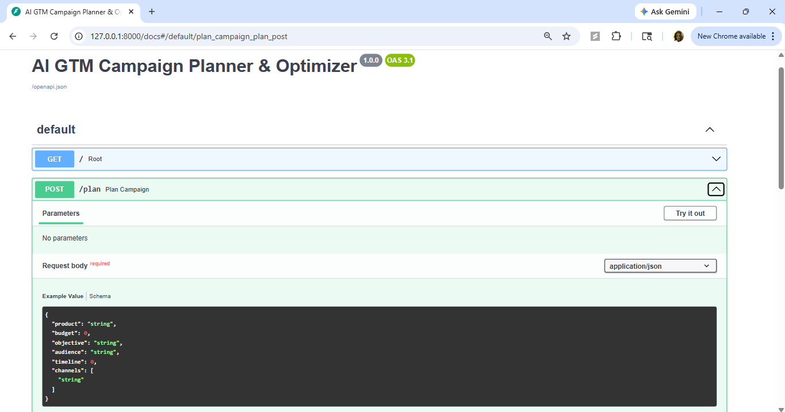
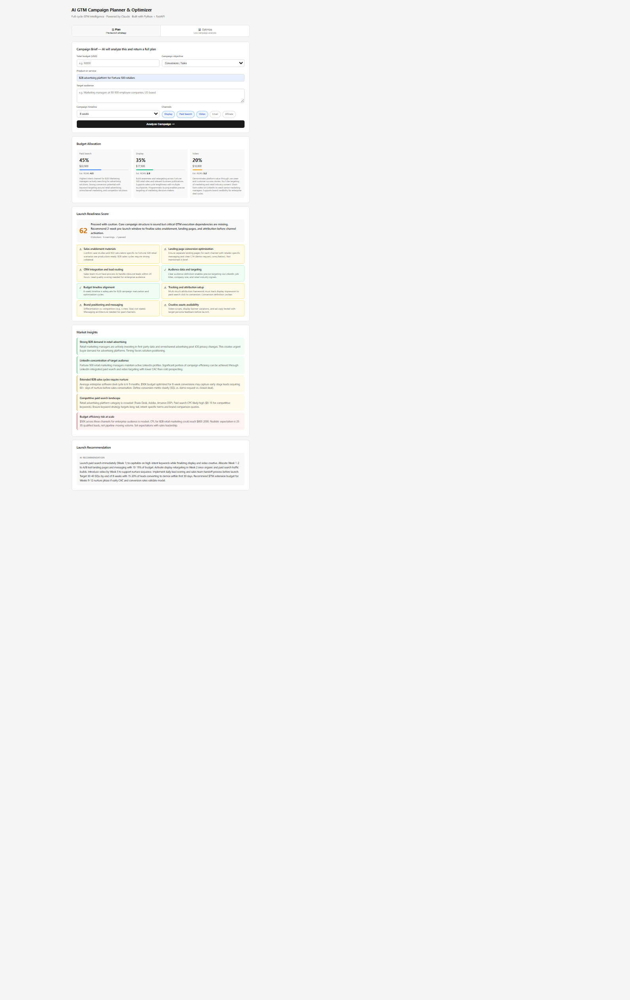
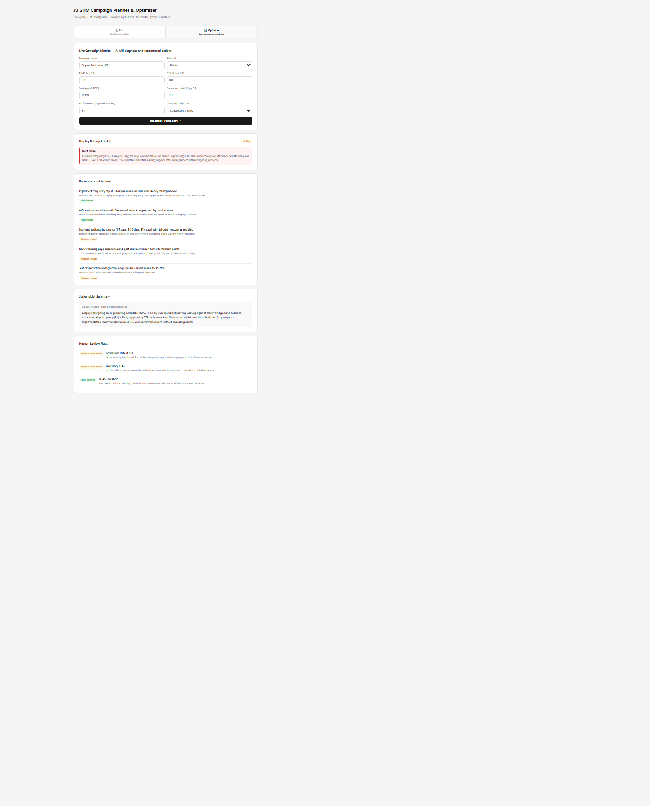
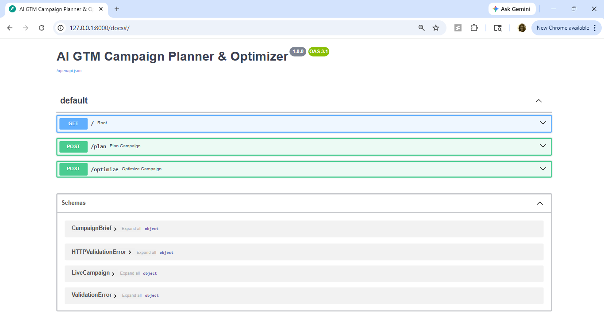

# AI GTM Campaign Planner & Optimizer

AI-powered decision-support system for GTM, marketing, and campaign teams that improves pre-launch planning, live campaign optimization, and stakeholder communication.

Built with Python, FastAPI, and the Anthropic Claude API.

## Overview

AI GTM Campaign Planner & Optimizer is a business-facing AI application designed to support the full campaign lifecycle, from planning before launch to diagnosing underperformance during execution and drafting decision-ready updates for leadership or partner teams.

The system helps answer three critical business questions:

1. Planning: Am I allocating budget and preparing this campaign correctly before launch?
2. Optimization: Why is this campaign underperforming, and what should I do next?
3. Communication: How do I explain performance issues and recommended actions clearly to stakeholders?

The application is exposed through REST APIs, making it easy to integrate into internal tools, campaign workflows, or marketing operations environments.

## Business Problem

Teams running digital campaigns often have strong data visibility but weak decision support.

Before launch, campaign plans are frequently built from past experience, static playbooks, or manual assumptions. Teams may go live without validating budget allocation, audience readiness, channel fit, creative completeness, or launch dependencies.

During campaign execution, performance dashboards surface metrics such as ROAS, CTR, spend, and conversion rate, but they do not explain why performance is changing. Diagnosing root cause often requires a skilled analyst manually connecting multiple signals, which slows down response and increases the chance of incorrect decisions.

After a problem is identified, campaign managers still need to translate analysis into a clear recommendation for leadership, finance, or partner teams. That communication step is often manual, inconsistent, and time-consuming.

The result is the same across all three phases:
- wasted ad spend  
- slower decisions  
- missed performance targets  
- inconsistent stakeholder communication  

This project was built to reduce that friction by combining planning, optimization, and communication into one AI-assisted workflow.

## Why I Built This

I built this project because I saw a recurring gap in campaign and GTM workflows: teams usually have access to data, but not to fast, consistent reasoning that helps them decide what to do next.

In real business settings, campaign managers often need to:
- evaluate whether a campaign is ready to launch  
- decide how budget should be distributed across channels  
- diagnose underperformance using incomplete or scattered signals  
- communicate recommendations clearly to non-technical stakeholders  

Those tasks are critical, but they are also repetitive, judgment-heavy, and time-sensitive.

I wanted to explore how AI could reduce friction in those workflows by acting as a business-facing decision-support system, one that helps teams plan more intelligently, respond faster during live campaigns, and communicate more clearly with leadership or partners.

This project is my attempt to turn that operational gap into an end-to-end AI system that supports faster decisions, clearer communication, and more scalable GTM execution.

## What the System Does

The system is designed around two core business workflows.

### 1. Pre-Launch Campaign Planning
Takes a campaign brief as input and returns:
- recommended budget allocation by channel  
- expected ROAS ranges  
- market opportunity insights  
- launch readiness checks  
- overall launch recommendation  

### 2. Live Campaign Optimization
Takes live campaign metrics as input and returns:
- campaign status  
- likely root-cause diagnosis  
- prioritized optimization recommendations  
- stakeholder-ready summary  
- human-review flags for sensitive decisions  

This makes the application more than a dashboard or chatbot. It is a prototype for an AI-powered GTM decision-support tool.

## Key Capabilities

| Endpoint | Capability | Business Value |
|---|---|---|
| `POST /plan` | Analyzes a campaign brief and recommends budget allocation, readiness checks, and launch guidance | Helps teams make stronger pre-launch decisions before spend begins |
| `POST /optimize` | Diagnoses live campaign performance, explains likely root causes, and recommends actions | Improves speed and consistency of campaign optimization |
| `GET /` | Returns app status and docs link | Supports lightweight service health and developer testing |

## System Workflow

**Detect → Explain → Recommend → Draft → Flag**

- Detect → Identify meaningful signals  
- Explain → Diagnose root causes  
- Recommend → Suggest next actions  
- Draft → Generate stakeholder communication  
- Flag → Identify decisions needing human review  

## Architecture

1. Input Layer → campaign brief or metrics  
2. FastAPI Layer → routes request  
3. Claude API → structured reasoning  
4. Response Layer → business-ready output  

## Tech Stack

- Python  
- FastAPI  
- Pydantic  
- Anthropic Claude API  
- dotenv  

## API Endpoints

### `GET /`
Returns service status and docs link  

### `POST /plan`
Returns:
- budget allocation  
- readiness checks  
- insights  
- launch recommendation  

### `POST /optimize`
Returns:
- status  
- root cause  
- recommendations  
- stakeholder summary  
- flags  

## Example Use Cases

### Pre-Launch Planning
Validate budget allocation across channels  

### Underperformance Diagnosis
Understand why metrics dropped  

### Stakeholder Communication
Generate executive-ready summaries  

## Sample Input

### Example `POST /plan`

```json
{
  "product": "New SaaS subscription offering",
  "budget": 50000,
  "objective": "Lead generation",
  "audience": "Mid-market B2B decision makers",
  "timeline": 6,
  "channels": ["Search", "Display", "Video"]
}
```

### Example `POST /optimize`

```json
{
  "campaign_name": "Q3 Demand Gen Campaign",
  "channel": "Meta Ads",
  "roas": 1.8,
  "ctr": 0.7,
  "spend": 22000,
  "conversion_rate": 1.4,
  "frequency": 8.9,
  "campaign_objective": "Leads"
}
```

## Sample Output

### Example Planning Output

```json
{
  "budget_allocation": [
    {
      "channel": "Search",
      "percentage": 40,
      "dollar_amount": 20000,
      "expected_roas": "3.2x",
      "rationale": "High-intent demand capture supports lead generation goals."
    }
  ],
  "readiness_score": 82,
  "readiness_verdict": "Needs attention",
  "launch_recommendation": "Tracking validation required before launch."
}
```

### Example Optimization Output

```json
{
  "status": "at-risk",
  "root_cause": "Creative fatigue due to high frequency",
  "recommendations": [
    {
      "action": "Rotate creatives",
      "impact": "High"
    }
  ],
  "stakeholder_summary": "Campaign efficiency declining due to engagement drop.",
  "flags": [
    {
      "type": "human-review",
      "item": "Budget reallocation"
    }
  ]
}
```

## Project Structure

## Project Structure

```
ai-gtm-planner-optimizer/
├── main.py                    # FastAPI app with all endpoints (/plan, /optimize)
├── requirements.txt           # Python dependencies
├── .env.example               # Environment variable template (Claude API key)
├── assets/                    # Screenshots used in README
│   ├── campaign-planning-interface.png
│   ├── planning-output.png
│   ├── optimization-output.png
│   └── fastapi-swagger-docs.png
├── frontend/                  # Simple UI (if added / optional)
│   └── ...
└── README.md                  # Project documentation
```

## Installation

```bash
git clone https://github.com/Swathi-Krishna-Naik-Vankdoth/ai-gtm-planner-optimizer.git
cd ai-gtm-planner-optimizer
pip install -r requirements.txt
```

Create `.env`:

```bash
ANTHROPIC_API_KEY=your_api_key_here
```

Run:

```bash
uvicorn main:app --reload
```

Open:

- API docs → http://127.0.0.1:8000/docs  
- frontend → http://127.0.0.1:8000/app  

## Screenshots

  
  
  
  

## Future Improvements

- Adding nested response schemas for stronger validation  
- Prompt modularization: Moving prompts into reusable prompt-builder modules
- Error handling: Adding error handling for invalid model output 
- CSV uploads: Supporting CSV upload for multi-campaign analysis 
- Approval workflows: Integrating approval workflows for sensitive recommendations 
- Evaluation metrics: Adding evaluation metrics for recommendation quality and consistency

## What This Project Demonstrates

- Real-world problem solving  
- AI for business reasoning  
- Backend system design  
- API-based architecture  
- Human-in-the-loop workflows  

## License

For educational and portfolio use.

## Author

Swathi Krishna
